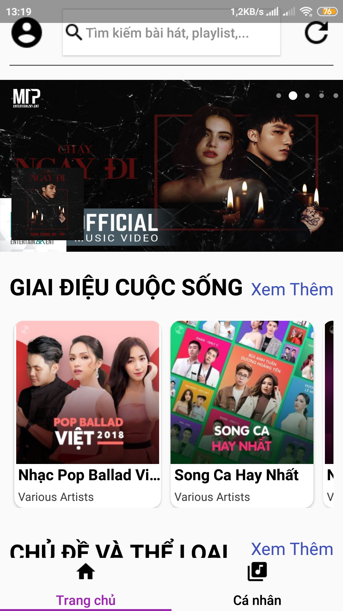
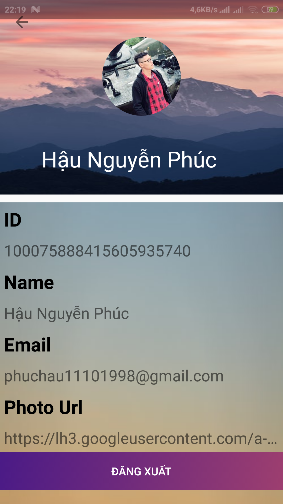
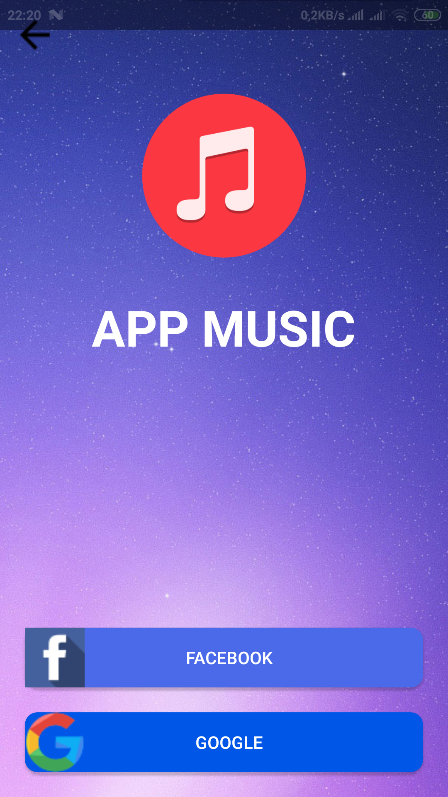
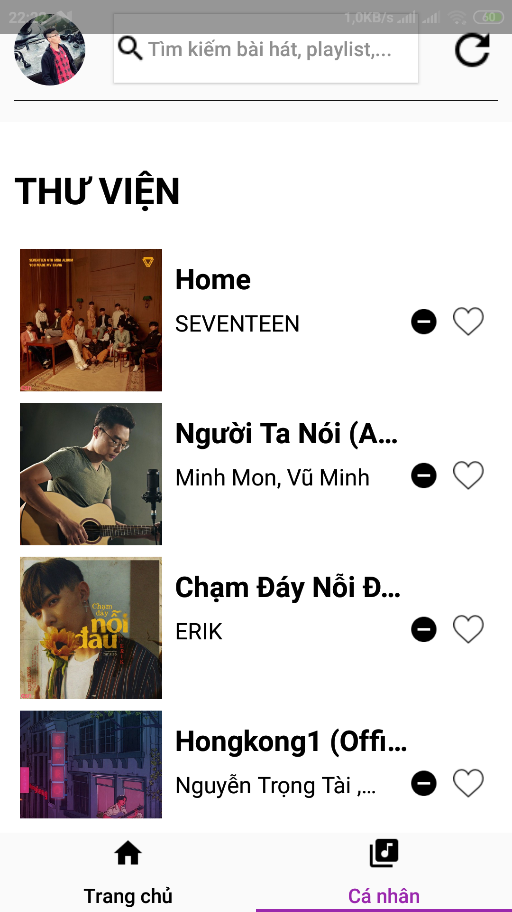
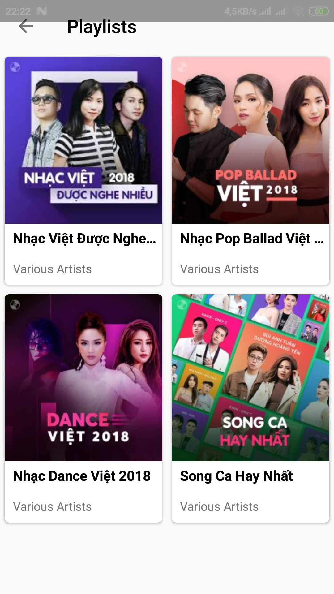
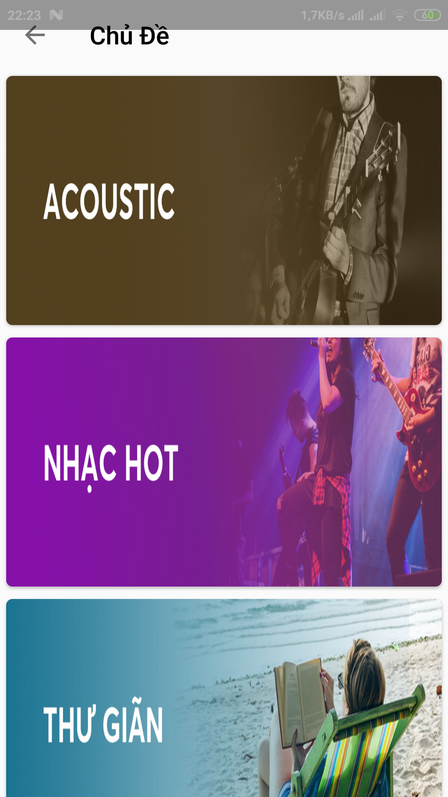
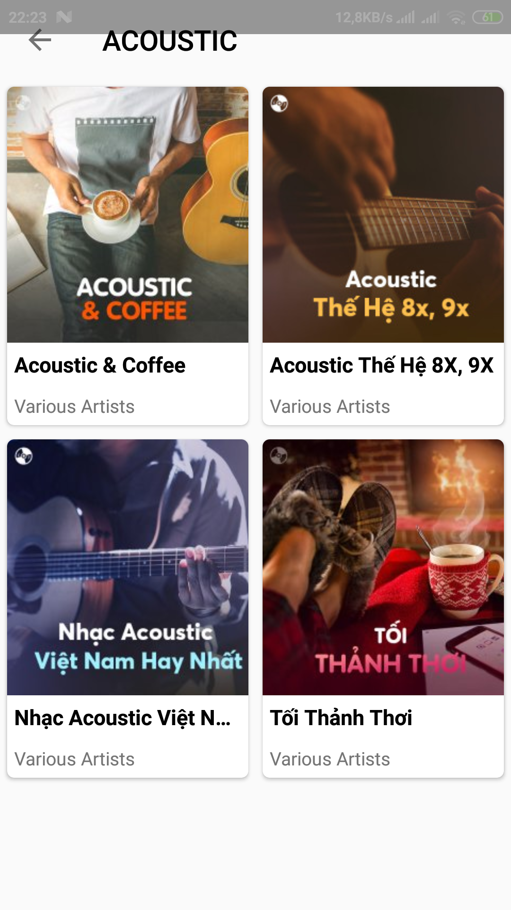
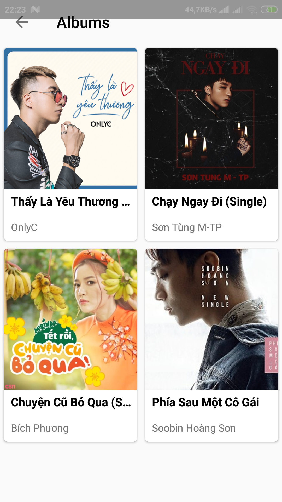
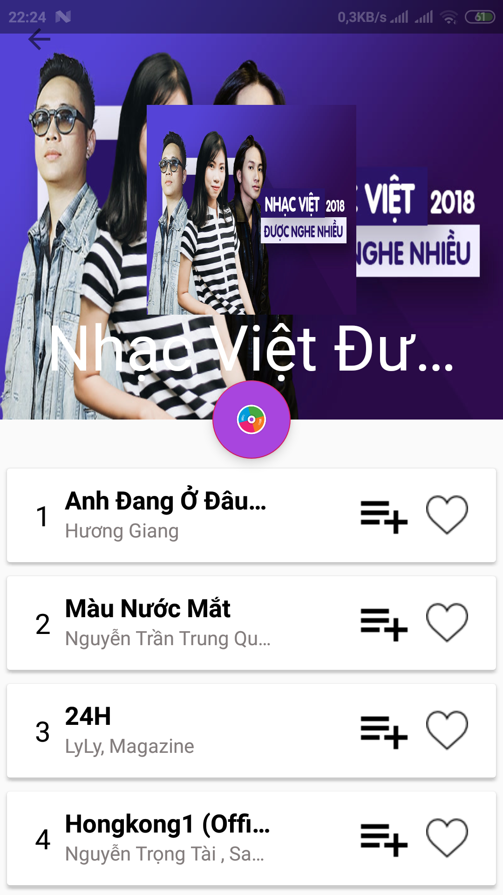
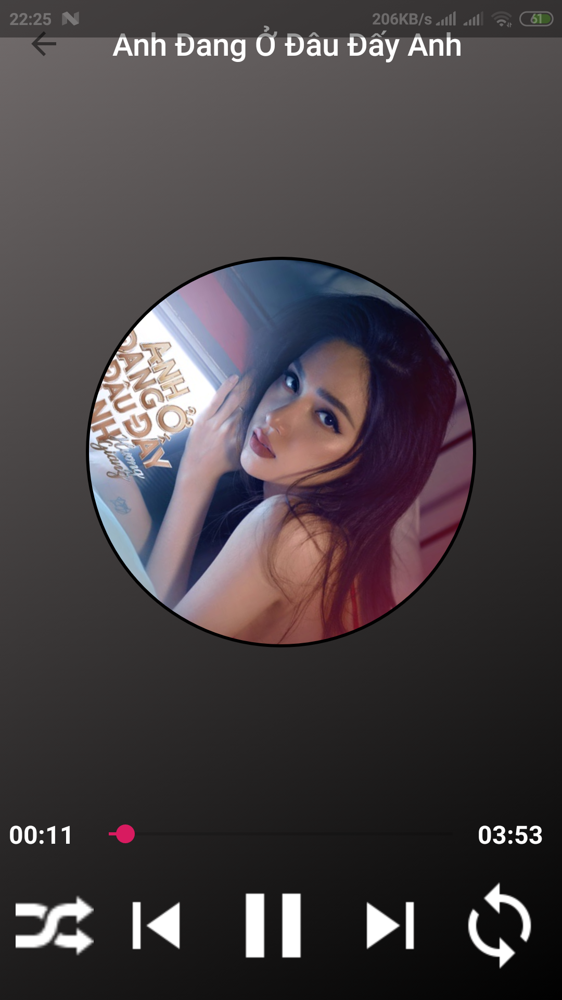

# Project Title

App Music on Android Studio.

# Description

This is Android project for Android Management subject. I'm still doing and get 80% progress. The code is available on Github. When I finish it, I will upload this app on Play Store. But now i don't have Play Store account for developer ^^. I will try my best to develop my app and upload it soon.

# Features

The app will display ads (if the singer has a new song that will run ads on the application) and every day the ads will run randomly.
- Application to display playlists (also random daily) like "Top 100 bài hát Vpop hot nhất tuần qua", ...
- Application to manage each topic like "Tình yêu", "Acoustic", ... and in each topic there will be more detailed sub-topics such as "Một thoáng", "Đã từng",...
- Display hot albums.
- Display recommended songs (show user likes when listening to songs).
- When listening to each song, the songs will have a "Favorites" button, if the favorite can be pressed.
- Play music toolbar will be similar to a normal music app like next, back, repeat, random, stop, play.
- Display list of user's favorite songs.
- Support listening to music online.
- Login with facebook and google

## Getting Started

Before running this project, you need some prerequisites and install something 

### Prerequisites

Install android studio
Current Android SDK Platform-Tools i use is 28 and Android API 25
Sure that library dependencies are compatable with your version SDK

### Installing

Just install Android Studio. You can download from url: https://developer.android.com/studio

## Deployment

Check your internet beacause php files are upload on host free so sometimes it's slow
After that run it and enjoy

## Screenshots

Some screenshots describe overview of my app and then you can understand what i have done.

  
   
  
  
  
  
  
  
  
  

## Authors

* **Hau Nguyen Phuc**
